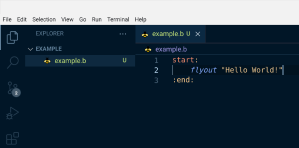
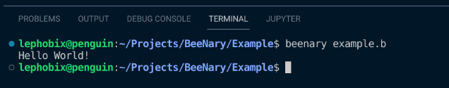

# Beenary

_BeeNary is a toy programming language that I created to get more into programming languages. In the past, I created other languages as well. Though due to my lack of programming experience, the way I coded my previous interpreters was very primitive and quite slow. This time I've managed to create a more reliable interpreter. But the method I'm using to create a programming language is still very simple and thus does not allow me to create very complex and fast programming languages._

_Consider BeeNary as a hobby project and not as a serious project. I'm not trying to create something revolutionary. I still have to learn a lot when it comes to programming._

_If you want to take a look at this project, feel free to download the source code. Maybe you can take my idea and make it better. :)_

<br>
<br>

### Installation

_Below you find the installation guide. Note that it works bests if you are on Linux. An Installation guide for Windows and macOS might come in the future._

<br>

1. Clone the repository
    ``` sh
    git clone https://github.com/kobalt66/BeeNary.git
    ```
2. Go into the root directory of the project 
3. Install the package
    ``` sh
    pip3 install .
    ```
4. If you are on Linux, make sure the `beenary` package is inside your `bin` folder. You may have to copy the file into the bin folder manually.
    This step will make sure that bash can access the `beenary` command.

5. If you use vs code you can copy the extention folder called '`b`' into your extention folder of vs code. It will enable code highlighting for beenary scripts.

<br>
<br>

### How to use BeeNary
1. Too create a beenary program create a file labeled like this: `name.b`

<br>

2. Now add some code to your file

<br>



3. Now run the program in the terminal

<br>


